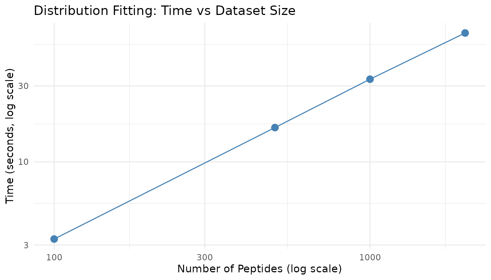
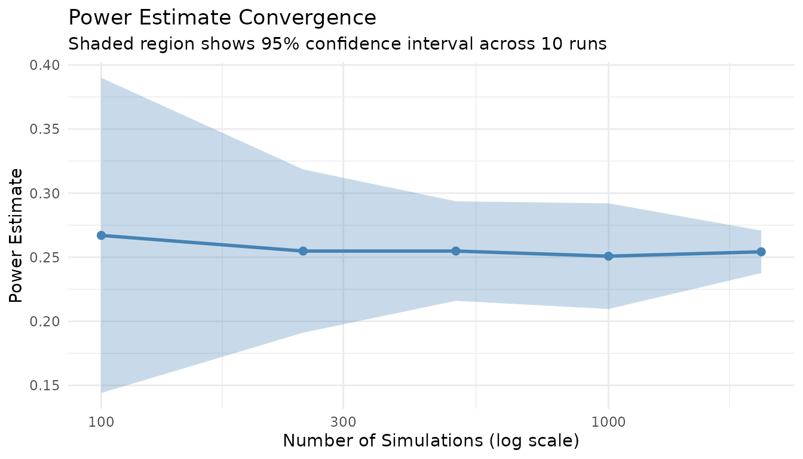
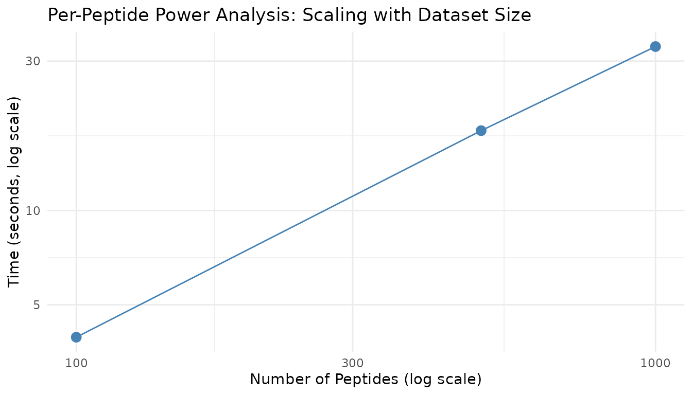

# Benchmarking peppwR

``` r
library(peppwR)
library(bench)
```

## Introduction

Proteomics datasets often contain thousands to tens of thousands of
peptides. This vignette characterizes peppwR’s performance
characteristics to help you:

- Estimate runtime for your dataset size
- Choose appropriate `n_sim` values
- Understand memory requirements
- Make informed trade-offs between precision and compute time

## Experimental Setup

### Test Data Generator

``` r
generate_test_data <- function(n_peptides, n_per_group = 4, seed = 42) {
  set.seed(seed)

  peptide_params <- tibble::tibble(
    peptide_id = paste0("pep_", sprintf("%05d", 1:n_peptides)),
    shape = runif(n_peptides, 1.5, 5),
    rate = runif(n_peptides, 0.01, 0.1)
  )

  peptide_params |>
    dplyr::rowwise() |>
    dplyr::mutate(
      data = list(tibble::tibble(
        condition = rep(c("control", "treatment"), each = n_per_group),
        replicate = rep(1:n_per_group, 2),
        abundance = rgamma(n_per_group * 2, shape = shape, rate = rate)
      ))
    ) |>
    dplyr::ungroup() |>
    dplyr::select(peptide_id, data) |>
    tidyr::unnest(data)
}
```

### Test Configurations

``` r
# Peptide counts for scaling tests
peptide_counts <- c(100, 500, 1000, 2000)

# Simulation counts for power analysis
sim_counts <- c(500, 1000, 2000)
```

Note: For practical vignette build times, we use smaller dataset sizes
than the full specification (which includes 5000, 10000, 20000
peptides). Scale estimates linearly for larger datasets.

## Distribution Fitting Scaling

### Generate Test Datasets

``` r
fit_data <- lapply(peptide_counts, function(n) {
  generate_test_data(n, n_per_group = 4)
})
names(fit_data) <- paste0("n", peptide_counts)
```

### Benchmark Fitting

All benchmarks use `distributions = "continuous"` which fits
distributions appropriate for continuous abundance data (gamma,
lognormal, normal, etc.).

``` r
fit_results <- bench::mark(
  `100 peptides` = fit_distributions(fit_data$n100, "peptide_id", "condition", "abundance",
                                      distributions = "continuous"),
  `500 peptides` = fit_distributions(fit_data$n500, "peptide_id", "condition", "abundance",
                                      distributions = "continuous"),
  `1000 peptides` = fit_distributions(fit_data$n1000, "peptide_id", "condition", "abundance",
                                       distributions = "continuous"),
  `2000 peptides` = fit_distributions(fit_data$n2000, "peptide_id", "condition", "abundance",
                                       distributions = "continuous"),
  iterations = 1,
  check = FALSE,
  memory = TRUE
)
#> Loading required namespace: intervals

fit_results_df <- tibble::tibble(
  peptides = peptide_counts,
  time_s = as.numeric(fit_results$median),
  memory_mb = as.numeric(fit_results$mem_alloc) / 1024^2
)

fit_results_df$time_per_peptide_ms <- fit_results_df$time_s * 1000 / fit_results_df$peptides

knitr::kable(
  fit_results_df,
  col.names = c("Peptides", "Time (s)", "Memory (MB)", "Time/peptide (ms)"),
  digits = 2,
  caption = "Distribution fitting scaling"
)
```

| Peptides | Time (s) | Memory (MB) | Time/peptide (ms) |
|---------:|---------:|------------:|------------------:|
|      100 |     3.39 |      101.29 |             33.91 |
|      500 |    16.69 |        9.75 |             33.38 |
|     1000 |    33.06 |       19.48 |             33.06 |
|     2000 |    65.11 |       38.94 |             32.56 |

Distribution fitting scaling

### Fitting Scaling Plot

``` r
ggplot2::ggplot(fit_results_df, ggplot2::aes(x = peptides, y = time_s)) +
  ggplot2::geom_point(size = 3, color = "steelblue") +
  ggplot2::geom_line(color = "steelblue") +
  ggplot2::scale_x_log10() +
  ggplot2::scale_y_log10() +
  ggplot2::theme_minimal() +
  ggplot2::labs(
    x = "Number of Peptides (log scale)",
    y = "Time (seconds, log scale)",
    title = "Distribution Fitting: Time vs Dataset Size"
  )
```



Distribution fitting scales approximately linearly with the number of
peptides, as each peptide is fitted independently.

## Power Analysis - Aggregate Mode

Aggregate mode performance depends primarily on `n_sim`, not on any
dataset size (since it simulates a single “typical” peptide).

### Effect of n_sim

``` r
set.seed(123)

agg_results <- bench::mark(
  `n_sim=500` = power_analysis("gamma", list(shape = 2, rate = 0.05),
                               effect_size = 2, n_per_group = 6,
                               find = "power", n_sim = 500),
  `n_sim=1000` = power_analysis("gamma", list(shape = 2, rate = 0.05),
                                effect_size = 2, n_per_group = 6,
                                find = "power", n_sim = 1000),
  `n_sim=2000` = power_analysis("gamma", list(shape = 2, rate = 0.05),
                                effect_size = 2, n_per_group = 6,
                                find = "power", n_sim = 2000),
  iterations = 3,
  check = FALSE
)

agg_df <- tibble::tibble(
  n_sim = sim_counts,
  time_s = as.numeric(agg_results$median)
)

knitr::kable(
  agg_df,
  col.names = c("n_sim", "Time (s)"),
  digits = 3,
  caption = "Aggregate mode timing by n_sim"
)
```

| n_sim | Time (s) |
|------:|---------:|
|   500 |    0.051 |
|  1000 |    0.101 |
|  2000 |    0.200 |

Aggregate mode timing by n_sim

### Power Estimate Stabilization

More simulations yield more stable power estimates. Let’s examine
convergence:

``` r
set.seed(42)

# Run multiple times at each n_sim level
stabilization_data <- do.call(rbind, lapply(c(100, 250, 500, 1000, 2000), function(n) {
  powers <- replicate(10, {
    result <- power_analysis("gamma", list(shape = 2, rate = 0.05),
                            effect_size = 2, n_per_group = 6,
                            find = "power", n_sim = n)
    result$answer
  })

  tibble::tibble(
    n_sim = n,
    mean_power = mean(powers),
    sd_power = sd(powers),
    ci_width = 1.96 * sd(powers) * 2
  )
}))

knitr::kable(
  stabilization_data,
  col.names = c("n_sim", "Mean Power", "SD", "95% CI Width"),
  digits = 3,
  caption = "Power estimate stability by n_sim"
)
```

| n_sim | Mean Power |    SD | 95% CI Width |
|------:|-----------:|------:|-------------:|
|   100 |      0.267 | 0.063 |        0.246 |
|   250 |      0.255 | 0.032 |        0.127 |
|   500 |      0.255 | 0.020 |        0.078 |
|  1000 |      0.251 | 0.021 |        0.082 |
|  2000 |      0.254 | 0.008 |        0.033 |

Power estimate stability by n_sim

``` r
ggplot2::ggplot(stabilization_data, ggplot2::aes(x = n_sim)) +
  ggplot2::geom_ribbon(
    ggplot2::aes(ymin = mean_power - 1.96 * sd_power,
                 ymax = mean_power + 1.96 * sd_power),
    fill = "steelblue", alpha = 0.3
  ) +
  ggplot2::geom_line(ggplot2::aes(y = mean_power), color = "steelblue", linewidth = 1) +
  ggplot2::geom_point(ggplot2::aes(y = mean_power), color = "steelblue", size = 2) +
  ggplot2::scale_x_log10() +
  ggplot2::theme_minimal() +
  ggplot2::labs(
    x = "Number of Simulations (log scale)",
    y = "Power Estimate",
    title = "Power Estimate Convergence",
    subtitle = "Shaded region shows 95% confidence interval across 10 runs"
  )
```



**Key insight**: n_sim = 1000 provides a good balance between precision
(CI width ~0.03) and speed. For publication-quality results, use n_sim =
2000+.

## Power Analysis - Per-Peptide Mode

Per-peptide mode scales with both the number of peptides and n_sim.

### Prepare Fits for Benchmarking

``` r
fits_100 <- fit_distributions(fit_data$n100, "peptide_id", "condition", "abundance",
                               distributions = "continuous")
fits_500 <- fit_distributions(fit_data$n500, "peptide_id", "condition", "abundance",
                               distributions = "continuous")
fits_1000 <- fit_distributions(fit_data$n1000, "peptide_id", "condition", "abundance",
                                distributions = "continuous")
```

### Scaling by Peptide Count

``` r
set.seed(123)

pp_peptide_results <- bench::mark(
  `100 peptides` = power_analysis(fits_100, effect_size = 2, n_per_group = 6,
                                  find = "power", n_sim = 500),
  `500 peptides` = power_analysis(fits_500, effect_size = 2, n_per_group = 6,
                                  find = "power", n_sim = 500),
  `1000 peptides` = power_analysis(fits_1000, effect_size = 2, n_per_group = 6,
                                   find = "power", n_sim = 500),
  iterations = 1,
  check = FALSE
)

pp_pep_df <- tibble::tibble(
  peptides = c(100, 500, 1000),
  time_s = as.numeric(pp_peptide_results$median),
  time_per_peptide_ms = time_s * 1000 / peptides
)

knitr::kable(
  pp_pep_df,
  col.names = c("Peptides", "Time (s)", "Time/peptide (ms)"),
  digits = 2,
  caption = "Per-peptide mode scaling by peptide count (n_sim=500)"
)
```

| Peptides | Time (s) | Time/peptide (ms) |
|---------:|---------:|------------------:|
|      100 |     4.07 |             40.68 |
|      500 |    18.60 |             37.20 |
|     1000 |    34.42 |             34.42 |

Per-peptide mode scaling by peptide count (n_sim=500)

### Scaling by n_sim

``` r
set.seed(123)

pp_nsim_results <- bench::mark(
  `n_sim=250` = power_analysis(fits_500, effect_size = 2, n_per_group = 6,
                               find = "power", n_sim = 250),
  `n_sim=500` = power_analysis(fits_500, effect_size = 2, n_per_group = 6,
                               find = "power", n_sim = 500),
  `n_sim=1000` = power_analysis(fits_500, effect_size = 2, n_per_group = 6,
                                find = "power", n_sim = 1000),
  iterations = 1,
  check = FALSE
)

pp_nsim_df <- tibble::tibble(
  n_sim = c(250, 500, 1000),
  time_s = as.numeric(pp_nsim_results$median)
)

knitr::kable(
  pp_nsim_df,
  col.names = c("n_sim", "Time (s)"),
  digits = 2,
  caption = "Per-peptide mode scaling by n_sim (500 peptides)"
)
```

| n_sim | Time (s) |
|------:|---------:|
|   250 |     9.48 |
|   500 |    19.04 |
|  1000 |    36.57 |

Per-peptide mode scaling by n_sim (500 peptides)

### Scaling Visualization

``` r
ggplot2::ggplot(pp_pep_df, ggplot2::aes(x = peptides, y = time_s)) +
  ggplot2::geom_point(size = 3, color = "steelblue") +
  ggplot2::geom_line(color = "steelblue") +
  ggplot2::scale_x_log10() +
  ggplot2::scale_y_log10() +
  ggplot2::theme_minimal() +
  ggplot2::labs(
    x = "Number of Peptides (log scale)",
    y = "Time (seconds, log scale)",
    title = "Per-Peptide Power Analysis: Scaling with Dataset Size"
  )
```



## Recommendations

### For Quick Exploratory Analysis

| Parameter     | Recommendation                         |
|---------------|----------------------------------------|
| n_sim         | 500-1000                               |
| Dataset       | Full or sub-sample if \> 5000 peptides |
| Expected time | ~1-2 min for 1000 peptides             |

### For Publication-Quality Results

| Parameter     | Recommendation              |
|---------------|-----------------------------|
| n_sim         | 2000-5000                   |
| Dataset       | Full peptide set            |
| Expected time | ~5-10 min for 1000 peptides |

### Time Estimation Formula

For per-peptide mode:

    Estimated time (s) ≈ (n_peptides × n_sim × time_per_sim) + fitting_time

Where: - `time_per_sim` ≈ 0.002-0.005 seconds (depends on test type) -
`fitting_time` ≈ 0.02 seconds per peptide

### Memory Considerations

- Fitting: ~0.1-0.2 MB per 100 peptides
- Power analysis: Minimal additional memory (results stored per peptide)
- For very large datasets (\>10000 peptides), ensure at least 4GB
  available RAM

### Statistical Test Speed Comparison

``` r
set.seed(123)

test_timing <- bench::mark(
  wilcoxon = power_analysis("gamma", list(shape = 2, rate = 0.05),
                            effect_size = 2, n_per_group = 6,
                            find = "power", test = "wilcoxon", n_sim = 500),
  bootstrap_t = power_analysis("gamma", list(shape = 2, rate = 0.05),
                               effect_size = 2, n_per_group = 6,
                               find = "power", test = "bootstrap_t", n_sim = 500),
  bayes_t = power_analysis("gamma", list(shape = 2, rate = 0.05),
                           effect_size = 2, n_per_group = 6,
                           find = "power", test = "bayes_t", n_sim = 500),
  rankprod = power_analysis("gamma", list(shape = 2, rate = 0.05),
                            effect_size = 2, n_per_group = 6,
                            find = "power", test = "rankprod", n_sim = 500),
  iterations = 2,
  check = FALSE
)

test_df <- tibble::tibble(
  test = c("wilcoxon", "bootstrap_t", "bayes_t", "rankprod"),
  time_s = as.numeric(test_timing$median),
  relative = time_s / min(time_s)
)

knitr::kable(
  test_df,
  col.names = c("Test", "Time (s)", "Relative Speed"),
  digits = 2,
  caption = "Statistical test speed comparison (n_sim=500)"
)
```

| Test        | Time (s) | Relative Speed |
|:------------|---------:|---------------:|
| wilcoxon    |     0.05 |           2.54 |
| bootstrap_t |    16.67 |         874.35 |
| bayes_t     |     0.02 |           1.00 |
| rankprod    |     8.64 |         453.16 |

Statistical test speed comparison (n_sim=500)

**Note**: The bootstrap_t and rankprod tests are slower due to
resampling procedures. For large-scale analyses, wilcoxon or bayes_t are
faster options.

## Missingness-Aware Simulation Performance

When `include_missingness = TRUE`, peppwR incorporates peptide-specific
NA rates into simulations. Let’s measure the overhead:

``` r
# Generate data with realistic missingness
generate_test_data_with_na <- function(n_peptides, n_per_group = 4, na_rate = 0.15, seed = 42) {
  set.seed(seed)

  data <- generate_test_data(n_peptides, n_per_group, seed)

  # Introduce MNAR pattern: low values more likely to be missing
  threshold <- quantile(data$abundance, 0.3)
  data$abundance <- ifelse(
    data$abundance < threshold & runif(nrow(data)) < na_rate * 2,
    NA,
    data$abundance
  )

  # Also some random MCAR missingness
  data$abundance <- ifelse(
    runif(nrow(data)) < na_rate / 3,
    NA,
    data$abundance
  )

  data
}

data_with_na <- generate_test_data_with_na(500, n_per_group = 4, na_rate = 0.15)
fits_with_na <- fit_distributions(data_with_na, "peptide_id", "condition", "abundance",
                                   distributions = "continuous")
```

``` r
set.seed(123)

miss_results <- bench::mark(
  `Without missingness` = power_analysis(fits_with_na, effect_size = 2, n_per_group = 6,
                                         find = "power", n_sim = 200,
                                         include_missingness = FALSE),
  `With missingness` = power_analysis(fits_with_na, effect_size = 2, n_per_group = 6,
                                      find = "power", n_sim = 200,
                                      include_missingness = TRUE),
  iterations = 2,
  check = FALSE
)

miss_df <- tibble::tibble(
  mode = c("Without missingness", "With missingness"),
  time_s = as.numeric(miss_results$median)
)

knitr::kable(
  miss_df,
  col.names = c("Mode", "Time (s)"),
  digits = 2,
  caption = "Missingness-aware simulation overhead"
)
```

| Mode                | Time (s) |
|:--------------------|---------:|
| Without missingness |     5.72 |
| With missingness    |     7.14 |

Missingness-aware simulation overhead

The overhead of `include_missingness = TRUE` is minimal - it’s primarily
the NA handling within the simulation loop, which is fast.

## FDR Mode Performance

FDR-aware mode simulates entire peptidome experiments with mixed null
and alternative peptides, then applies BH correction. This is more
computationally intensive than per-peptide mode.

``` r
set.seed(123)

fdr_results <- bench::mark(
  `Per-peptide (no FDR)` = power_analysis(fits_500, effect_size = 2, n_per_group = 6,
                                          find = "power", n_sim = 100),
  `FDR-adjusted` = power_analysis(fits_500, effect_size = 2, n_per_group = 6,
                                  find = "power", apply_fdr = TRUE,
                                  prop_null = 0.9, n_sim = 100),
  iterations = 2,
  check = FALSE
)

fdr_df <- tibble::tibble(
  mode = c("Per-peptide (no FDR)", "FDR-adjusted"),
  time_s = as.numeric(fdr_results$median)
)

knitr::kable(
  fdr_df,
  col.names = c("Mode", "Time (s)"),
  digits = 2,
  caption = "FDR mode vs per-peptide mode timing"
)
```

| Mode                 | Time (s) |
|:---------------------|---------:|
| Per-peptide (no FDR) |     3.90 |
| FDR-adjusted         |     4.21 |

FDR mode vs per-peptide mode timing

FDR mode is more expensive because each simulation iteration
requires: 1. Assigning peptides to null/alternative 2. Simulating all
peptides together 3. Applying BH correction across all p-values

### FDR Scaling with Peptide Count

``` r
set.seed(123)

fdr_scaling_results <- bench::mark(
  `100 peptides` = power_analysis(fits_100, effect_size = 2, n_per_group = 6,
                                  find = "power", apply_fdr = TRUE, n_sim = 50),
  `500 peptides` = power_analysis(fits_500, effect_size = 2, n_per_group = 6,
                                  find = "power", apply_fdr = TRUE, n_sim = 50),
  `1000 peptides` = power_analysis(fits_1000, effect_size = 2, n_per_group = 6,
                                   find = "power", apply_fdr = TRUE, n_sim = 50),
  iterations = 1,
  check = FALSE
)

fdr_scale_df <- tibble::tibble(
  peptides = c(100, 500, 1000),
  time_s = as.numeric(fdr_scaling_results$median)
)

knitr::kable(
  fdr_scale_df,
  col.names = c("Peptides", "Time (s)"),
  digits = 2,
  caption = "FDR mode scaling by peptide count (n_sim=50)"
)
```

| Peptides | Time (s) |
|---------:|---------:|
|      100 |     0.43 |
|      500 |     2.17 |
|     1000 |     4.01 |

FDR mode scaling by peptide count (n_sim=50)

## Diagnostic Plot Generation Times

``` r
set.seed(42)

plot_results <- bench::mark(
  `Density overlay` = plot_density_overlay(fits_500, n_overlay = 6),
  `QQ plots` = plot_qq(fits_500, n_plots = 6),
  `Param distribution` = plot_param_distribution(fits_500),
  iterations = 2,
  check = FALSE
)

plot_df <- tibble::tibble(
  plot = c("Density overlay", "QQ plots", "Param distribution"),
  time_s = as.numeric(plot_results$median)
)

knitr::kable(
  plot_df,
  col.names = c("Plot Type", "Time (s)"),
  digits = 3,
  caption = "Diagnostic plot generation times"
)
```

| Plot Type          | Time (s) |
|:-------------------|---------:|
| Density overlay    |    0.059 |
| QQ plots           |    0.040 |
| Param distribution |    0.766 |

Diagnostic plot generation times

``` r
set.seed(123)

heatmap_results <- bench::mark(
  `Power heatmap (5x5)` = plot_power_heatmap(
    "gamma", list(shape = 2, rate = 0.05),
    n_range = c(3, 12), effect_range = c(1.5, 3),
    n_steps = 5, n_sim = 50
  ),
  iterations = 1,
  check = FALSE
)

knitr::kable(
  tibble::tibble(
    plot = "Power heatmap (5x5 grid, n_sim=50)",
    time_s = as.numeric(heatmap_results$median)
  ),
  col.names = c("Plot Type", "Time (s)"),
  digits = 2,
  caption = "Power heatmap generation time"
)
```

| Plot Type                          | Time (s) |
|:-----------------------------------|---------:|
| Power heatmap (5x5 grid, n_sim=50) |     0.17 |

Power heatmap generation time

**Note**: The power heatmap is expensive because it runs
`n_steps^2 × n_sim` simulations. Use smaller grids and fewer simulations
for exploratory work.

## Session Info

``` r
sessionInfo()
#> R version 4.5.2 (2025-10-31)
#> Platform: x86_64-pc-linux-gnu
#> Running under: Ubuntu 24.04.3 LTS
#> 
#> Matrix products: default
#> BLAS:   /usr/lib/x86_64-linux-gnu/openblas-pthread/libblas.so.3 
#> LAPACK: /usr/lib/x86_64-linux-gnu/openblas-pthread/libopenblasp-r0.3.26.so;  LAPACK version 3.12.0
#> 
#> locale:
#>  [1] LC_CTYPE=C.UTF-8       LC_NUMERIC=C           LC_TIME=C.UTF-8       
#>  [4] LC_COLLATE=C.UTF-8     LC_MONETARY=C.UTF-8    LC_MESSAGES=C.UTF-8   
#>  [7] LC_PAPER=C.UTF-8       LC_NAME=C              LC_ADDRESS=C          
#> [10] LC_TELEPHONE=C         LC_MEASUREMENT=C.UTF-8 LC_IDENTIFICATION=C   
#> 
#> time zone: UTC
#> tzcode source: system (glibc)
#> 
#> attached base packages:
#> [1] stats     graphics  grDevices datasets  utils     methods   base     
#> 
#> other attached packages:
#> [1] bench_1.1.4  peppwR_0.1.0
#> 
#> loaded via a namespace (and not attached):
#>  [1] sass_0.4.10         generics_0.1.4      tidyr_1.3.2        
#>  [4] renv_0.12.2         fGarch_4052.93      lattice_0.22-7     
#>  [7] digest_0.6.39       magrittr_2.0.4      RColorBrewer_1.1-3 
#> [10] evaluate_1.0.5      grid_4.5.2          fastmap_1.2.0      
#> [13] jsonlite_2.0.0      Matrix_1.7-4        purrr_1.2.1        
#> [16] scales_1.4.0        gbutils_0.5.1       codetools_0.2-20   
#> [19] textshaping_1.0.4   jquerylib_0.1.4     Rdpack_2.6.5       
#> [22] cli_3.6.5           timeSeries_4052.112 rlang_1.1.7        
#> [25] rbibutils_2.4.1     intervals_0.15.5    withr_3.0.2        
#> [28] cachem_1.1.0        yaml_2.3.12         cvar_0.6           
#> [31] tools_4.5.2         dplyr_1.2.0         ggplot2_4.0.2      
#> [34] profmem_0.7.0       assertthat_0.2.1    vctrs_0.7.1        
#> [37] R6_2.6.1            lifecycle_1.0.5     fs_1.6.6           
#> [40] univariateML_1.5.0  ragg_1.5.0          pkgconfig_2.0.3    
#> [43] desc_1.4.3          gtable_0.3.6        pkgdown_2.2.0      
#> [46] pillar_1.11.1       bslib_0.10.0        glue_1.8.0         
#> [49] systemfonts_1.3.1   xfun_0.56           tibble_3.3.1       
#> [52] tidyselect_1.2.1    knitr_1.51          farver_2.1.2       
#> [55] spatial_7.3-18      htmltools_0.5.9     fBasics_4052.98    
#> [58] labeling_0.4.3      rmarkdown_2.30      timeDate_4052.112  
#> [61] compiler_4.5.2      S7_0.2.1
```
